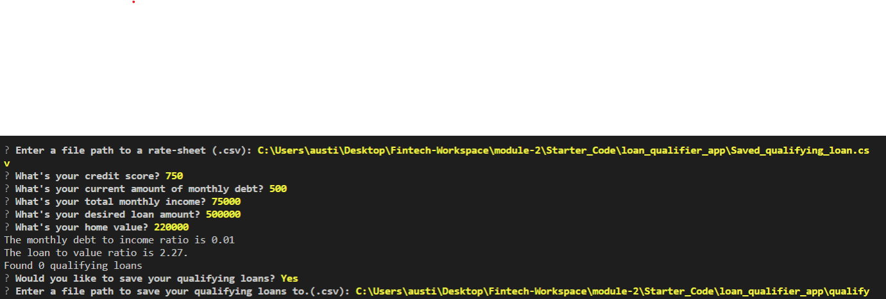

# Loan qualifier app.

Loan qualifier app. The loan qualifier app is a program designed to stream line qualifying for a home lone in order to see what banks are willing to loan money based on your credit score, debt to income ratio, loan to value ratio, and max loan size a bank is willing to offer.
If any banks are willing to loan based on your criteria it will ask if youd like to save those banks to a csv file for future use.

---

## Technologies
This project leverages python **3.7** with the following packages:

* [fire](https://github.com/google/python-fire) - **version 0.4.0** For the command line interface, help page, and entry-point.

* [questionary](https://github.com/tmbo/questionary) - **version 1.10.0** For interactive user prompts and dialogs
Python Fire is a library for automatically generating command line interfaces (CLIs) with a single line of code.


## Installation Guide
Before running the application first install the following dependencies.

```python
  pip install fire
  pip install questionary
```


---

## Usage
To use this app pass in theses parameters: Credit score, Current amount of monthly debt, Total monthly income, Desired loan amount, Home value.

It will return the banks that qualify you for a loan (out of a given data set) and ask if youd like to save them to a .csv file.





---

## Contributors
Primary contributor: Austin means Email:austinmeans92@gmail.com

---

## License

MIT
